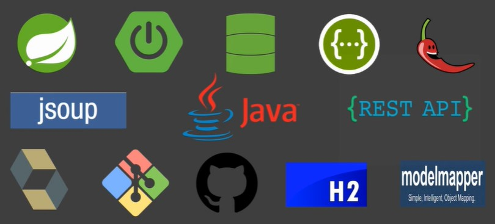

<h1 align="center">
  
</h1>

# brasileirao-api
Desenvolvimento de um Bot automatizado de raspagem de dados web, capturando informações sobre partidas na página principal do Google, tratando e armazenando os dados no bando de dados H2 e disponibilizando as informações da partida em tempo real em uma API REST. </br>

Developing of a bot using web scrapping to get soccer games information using google as a main source and saving the information in a memory db H2 and providing an API REST to get and manipulate the information. </br>

<h2>Web scrapping project</h2>

```
* shell script
mvn spring-boot:run
```
After execute the shell command you can check the api documentation:

```
API documentation:
- http://localhost:8080/swagger-ui.html
```

* Java 8 or higher.
* Maven 3.6.3 or higher.
* Intellj IDEA Community Edition.
* GIT.


<h3>API:</h3>

* Java 11
* JSOUP
* Spring Boot
* Spring Data JPA
* Lombok
* Swagger
* Hikari
* Banco de dados H2
* ModelMapper
* Modelo arquitetural REST
